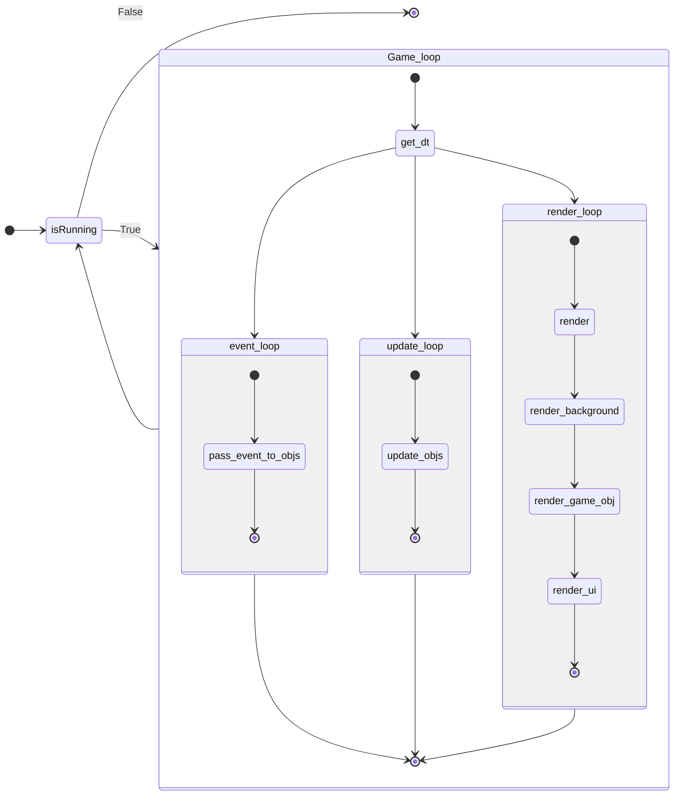
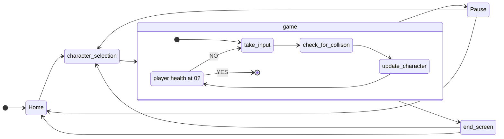
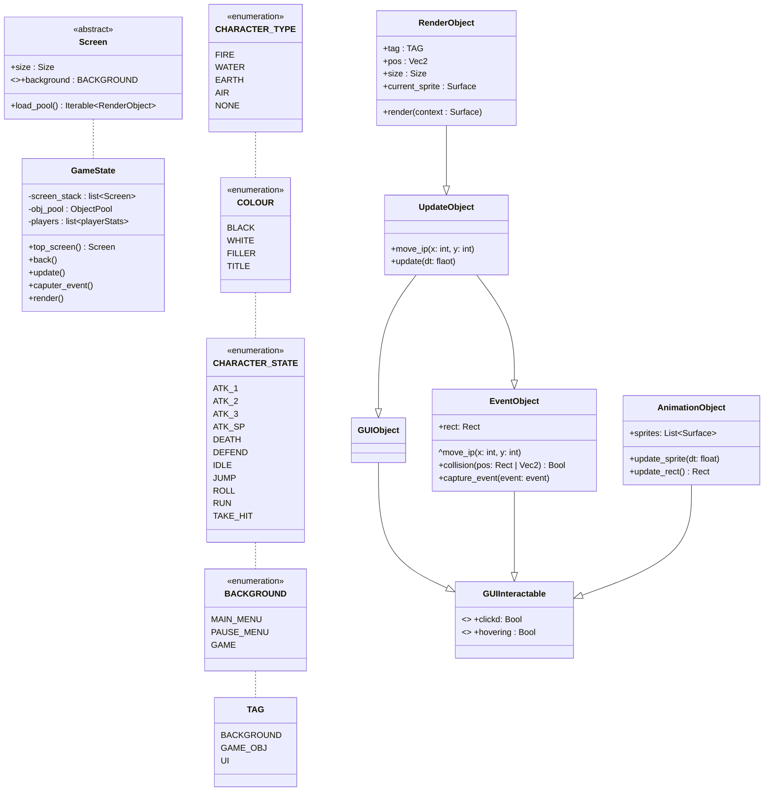

```mermaid

stateDiagram
direction LR

	[*] --> isRunning
	isRunning --> [*] : False
	isRunning --> Game_loop : True
	Game_loop --> isRunning

	state Game_loop{
		[*] --> get_dt
		get_dt --> event_loop
		get_dt --> update_loop
		get_dt --> render_loop

		event_loop --> [*]
		update_loop --> [*]
		render_loop --> [*]

		state event_loop{
			[*] --> pass_event_to_objs
			pass_event_to_objs --> [*]
		}

		state update_loop{
			[*] --> update_objs
			update_objs --> [*]
		}

		state render_loop{
			[*] --> render
			render --> render_background
			render_background --> render_game_obj
			render_game_obj --> render_ui
			render_ui --> [*]
		}
	}

```

```mermaid
stateDiagram
direction LR
	[*] --> Home
	Home --> character_selection
	character_selection --> game

	game --> Pause
	game --> end_screen

	end_screen --> character_selection
	end_screen --> Home

	Pause --> character_selection
	Pause --> Home

	state game {
		direction LR
		check_health : player health at 0?

		[*] --> take_input
		take_input --> check_for_collison
		check_for_collison --> update_character
		update_character --> check_health
		check_health --> [*] : YES
		check_health --> take_input : NO
	}

```

```mermaid
classDiagram

	Screen .. GameState

	CHARACTER_TYPE .. COLOUR
	COLOUR .. CHARACTER_STATE
	CHARACTER_STATE .. BACKGROUND
	BACKGROUND .. TAG

	RenderObject --|> UpdateObject
	UpdateObject --|> EventObject

	UpdateObject --|> GUIObject

	GUIObject --|> GUIInteractable
	EventObject --|> GUIInteractable
	AnimationObject --|> GUIInteractable


	class GameState{
		-screen_stack : list~Screen~
		-obj_pool : ObjectPool
		-players : list~playerStats~

		+top_screen() Screen
		+back()
		+update()
		+caputer_event()
		+render()
	}

	class CHARACTER_TYPE{
		<<enumeration>>
		FIRE
		WATER
		EARTH
		AIR
		NONE
	}

	class COLOUR{
		<<enumeration>>
		BLACK
		WHITE
		FILLER
		TITLE
	}

	class CHARACTER_STATE{
		<<enumeration>>
		ATK_1
		ATK_2
		ATK_3
		ATK_SP
		DEATH
		DEFEND
		IDLE
		JUMP
		ROLL
		RUN
		TAKE_HIT
	}

	class BACKGROUND{
		<<enumeration>>
		MAIN_MENU
		PAUSE_MENU
		GAME
	}

	class TAG{
		BACKGROUND
		GAME_OBJ
		UI
	}

	class Screen{
		<<abstract>>
		+size : Size
		<<get>>+background : BACKGROUND

		+load_pool() Iterable~RenderObject~
	}

	class RenderObject{
		+tag : TAG
		+pos : Vec2
		+size : Size
		+current_sprite : Surface
		+render(context : Surface)
	}

	class UpdateObject {
		+move_ip(x: int, y: int)
		+update(dt: flaot)
	}

	class EventObject{
		+rect: Rect

		^move_ip(x: int, y: int)
		+collision(pos: Rect | Vec2) Bool
		+capture_event(event: event)
	}

	class AnimationObject{
		+sprites: List~Surface~
		+update_sprite(dt: float)
		+update_rect() Rect
	}

	class GUIInteractable{
		<<get>> +clickd: Bool
		<<get>> +hovering : Bool
	}

```
