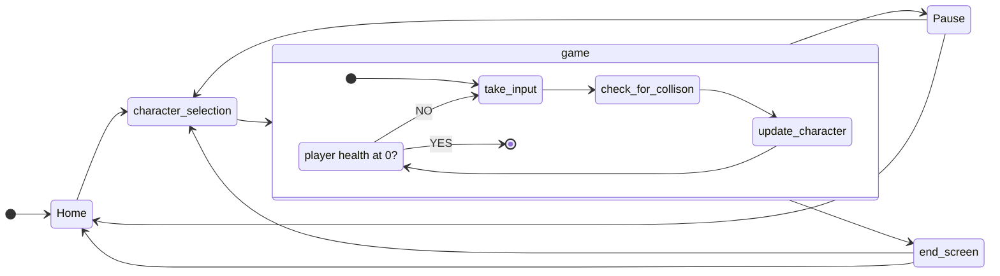
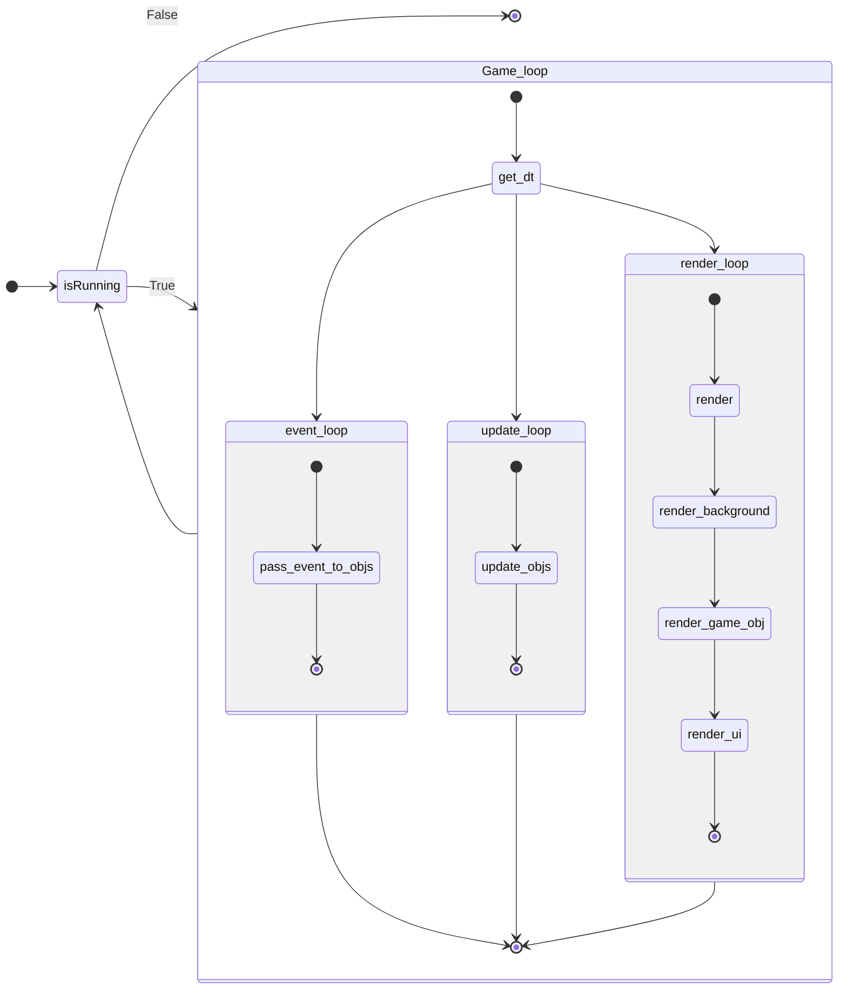

Python version: 3.10.4
assets found on Itch.io

| Player | Movement   | Attack | Defend |
| ------ | ---------- | ------ | ------ |
| 1      | WASD       | Q      | E      |
| 2      | Arrow Keys | {      | }      |

## More or less what I wanted the game to run like

## what i wanted the event loop to look like

